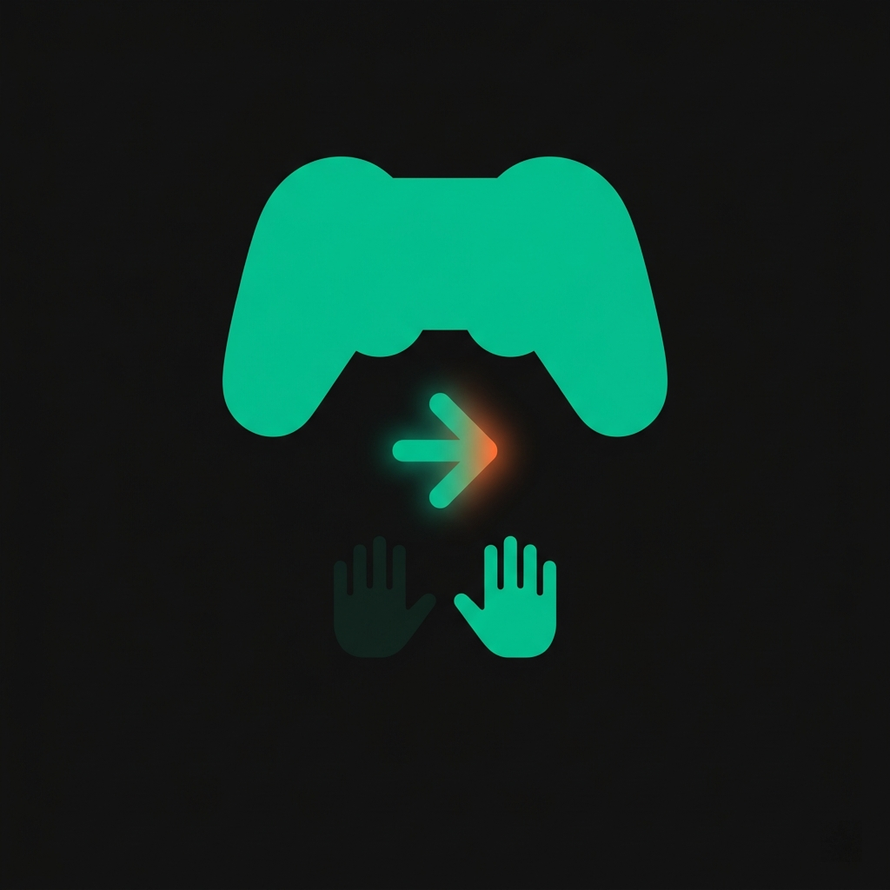

# PassTheStick

**Couch co-op energy for single-player games, over the internet.**

Take turns controlling a single-player game on one person's PC. Everyone watches via Discord screenshare. PassTheStick decides whose keyboard or controller is active.

> No screen capture. No video. No voice. Just input routing.

<p align="center">
  
</p>


---

## How it works

- The **host** runs the game + PassTheStick
- **Guests** install the lightweight client, enter a 4-character room code, and wait
- The host passes the stick with **Ctrl+Shift+→** (picker), the **player list**, or **tray** — whoever has it controls the game
- **Ctrl+Shift+←** on the host **takes the stick back** immediately
- Everyone else’s keys are blocked (when the pinned game is focused) until it’s their turn

---

## Install

1. Download the latest **`PassTheStick-Setup-<version>.exe`** from [Releases](../../releases)
2. Run the installer (administrator when prompted — needed for hooks/injection with some games)
3. Launch **PassTheStick** — choose **Host** or **Guest** from the launcher when offered
4. **Optional:** Controller support can install ViGEmBus / HidHide (may require a reboot)

> The installed folder contains compiled apps and a **`relay\`** subfolder (bundled Node + `server.js`) for **LAN / local** relay only. There is no `src\` tree in the install — clone the repo to hack on or self-host the relay from source.

---

## Quick start

### Host

1. Launch PassTheStick — the host app has a **main window** and a **system tray** icon
2. Complete the short **first-run tips** (optional; can skip)
3. If prompted, **restart as administrator** (some games need it for `SendInput` to work)
4. Pick your game in the window list and click **Pin selected window**
5. When connected, share the **room code** with guests (shown large in the UI — use **Copy code**)
6. Pass the stick: **Ctrl+Shift+→**, or select a guest and **Pass to selected**, **double-click** a row, or use **Pass** (visible when you hover a row), or use the tray menu
7. Open **Settings** (footer) to override **relay WebSocket URL**, enable optional **stick sounds** (Windows system sounds), or read hotkey reminders

### Guest

1. Launch PassTheStick (or `PassTheStick.exe` with guest mode if your shortcut uses it)
2. Enter the room code and your display name → **Join**
3. When the host passes you the stick, the app shows **YOU HAVE THE STICK** and (when connected) latency / status
4. Your keyboard or controller is sent to the host — the **game must be focused on the host PC** for input to apply

---

## Input support

| Guest input | What the host game receives |
|---|---|
| Keyboard | Keyboard (scan-code injected, works with Raw Input + DirectInput) |
| Xbox / XInput controller | Virtual Xbox controller via ViGEmBus |

> **Keyboard layouts:** guest **VK** is mapped on the host with `MapVirtualKey`; guest scan code is a fallback when needed (e.g. AZERTY guest → QWERTY host).

---

## Overlay

A small **pill** shows whose turn it is while the **pinned game window** is in the foreground. Drag it to move. Hover for a short **queue** hint and **Pass**.

> Use **borderless** or **windowed** mode so the overlay stays visible. **Exclusive fullscreen** can hide it.

---

## Relay server

PassTheStick uses a **WebSocket relay** (Node + `ws` in this repo) to route control and messages.

| Mode | What to do |
|------|------------|
| **Default** | No setup — the app uses the **cloud relay** baked into `Constants` (overridable). |
| **Env override** | Set `PTS_RELAY_URL=wss://your-server` before launch. |
| **In-app** | Host **Settings** → relay URL → saved to `%AppData%\PassTheStick\settings.json`. |
| **Local / LAN** | Tray: start **bundled relay** (requires installer `relay\` files), or self-host from source. |

**Self-host from GitHub:** releases attach **`PassTheStick-relay-selfhost.zip`** (`server.js`, `package.json`, Docker/fly files — not the full `node_modules`; run `npm install` where you deploy).

---

## Build from source

Requirements: [.NET 8 SDK](https://dotnet.microsoft.com/download/dotnet/8.0) (Windows)

```bash
dotnet build PassTheStick.sln --configuration Release
```

**CI / installer:** pushing a git tag `v*` runs GitHub Actions — publish self-contained Host, Guest, Launcher; bundle relay runtime into `publish\app\relay\`; run Inno Setup → `output\PassTheStick-Setup-<tag>.exe`. Align **tag**, **`PassTheStick.Host.csproj` `<Version>`**, and Inno **`AppVersion`** (CI passes `/DAppVersion=` from the tag).

---

## Game compatibility

| Scenario | Example | What to verify |
|---|---|---|
| Raw Input (elevated) | Elden Ring | UAC + scan code injection |
| DirectInput | Older title / emulator | Keyboard + ViGEm |
| XInput-only | Game ignores keyboard | ViGEm + HidHide |
| Foreground strict | Game ignores input when unfocused | Host pins correct window; focus on host |
| Scan code / layout | Non-QWERTY host or guest | MapVirtualKey + sc fallback |
| Multiple controllers | Game picks "first" controller | Only one ViGEm device visible |
| Borderless fullscreen | Most modern games | Overlay visible, focus correct |

> **Do not use PassTheStick in online or competitive game modes.** It is for **local / couch** style play on a single copy of a game.

---

## Frequently asked questions

**Does the guest need to install anything?**  
Yes — the PassTheStick guest build. No drivers for keyboard-only. Controller path needs ViGEm (host) and optionally HidHide.

**Does it work if we're not on the same network?**  
Yes, with the cloud relay or any reachable `wss://` / `ws://` relay. No port forwarding for guests.

**Will it get me banned?**  
It uses normal Windows input APIs. Still: use only in **offline / single-player** contexts you’re allowed to modify.

**What about mouse?**  
Not supported in v1; controller + keyboard only.

---

## License

MIT — see [LICENSE](LICENSE)
